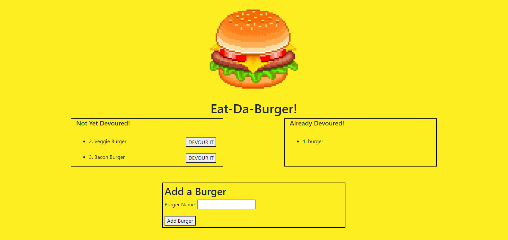

# README Generator
  
  

  ## Description 
  A single page restaurant application where users can input the names of burgers they'd like to eat and click a button to "eat" them.

  ## Table of Contents
  * [Usage](#usage)
  * [Credits](#credits)
  * [License](#license)
  * [Link to Deployed Application](#link-to-deployed-application)
  * [Questions](#questions)

  

  ## Usage
  
  Upon navigating to the page, any burger information stored in the database will be rendered. Each burger with "devoured:false" will be listed on the left by name along with their id number and a "Devour It" button. Burgers with "devoured:true" will be listed on the right by name with their id as well. The user can click a burger's "Devour It" button to update that burgers "devoured" status and move it to the right side of the screen. Below the user can use the Add a Burger form to add a new burger into the database. 

  ### Usage Screenshots  
  Application Home Page 
  

  ## Credits 
  * Graham Dickey gdickey273
 

  ## License 
  MIT License 
  Copyright (c) [2020] [Graham Dickey]
    
    Permission is hereby granted, free of charge, to any person obtaining a copy
    of this software and associated documentation files (the "Software"), to deal
    in the Software without restriction, including without limitation the rights
    to use, copy, modify, merge, publish, distribute, sublicense, and/or sell
    copies of the Software, and to permit persons to whom the Software is
    furnished to do so, subject to the following conditions:
    
    The above copyright notice and this permission notice shall be included in all
    copies or substantial portions of the Software.
    
    THE SOFTWARE IS PROVIDED "AS IS", WITHOUT WARRANTY OF ANY KIND, EXPRESS OR
    IMPLIED, INCLUDING BUT NOT LIMITED TO THE WARRANTIES OF MERCHANTABILITY,
    FITNESS FOR A PARTICULAR PURPOSE AND NONINFRINGEMENT. IN NO EVENT SHALL THE
    AUTHORS OR COPYRIGHT HOLDERS BE LIABLE FOR ANY CLAIM, DAMAGES OR OTHER
    LIABILITY, WHETHER IN AN ACTION OF CONTRACT, TORT OR OTHERWISE, ARISING FROM,
    OUT OF OR IN CONNECTION WITH THE SOFTWARE OR THE USE OR OTHER DEALINGS IN THE
    SOFTWARE.

  ## Link to Deployed Application
  https://calm-mountain-13174.herokuapp.com/

  ## Questions
  Contact me with any questions you have regarding my project.   
  Email: gdickey273@gmail.com  
  Github: https://github.com/gdickey273  
